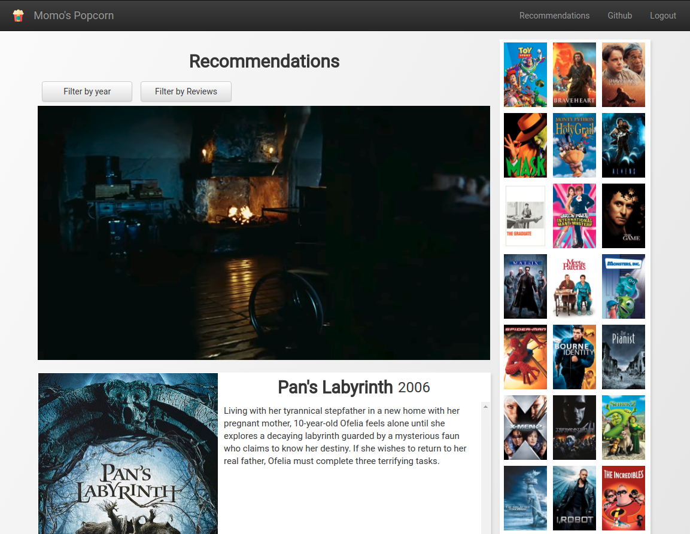
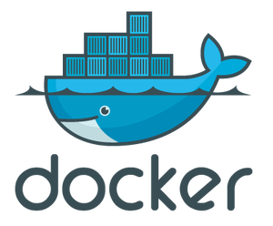
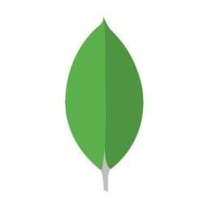

---
# Feel free to add content and custom Front Matter to this file.
# To modify the layout, see https://jekyllrb.com/docs/themes/#overriding-theme-defaults

layout: default
---

# Index

[About me](./about)

## Projects

### [Machine Learning Notebook](https://calvinfeng.gitbook.io/machine-learning-notebook/)

This is my central repository for collecting all my notes and references on machine learning, which
includes a lot of mathematical derivations to better my own understanding of every algorithm I learned.

### [My Playground: Guitar Journey](http://playground-dev.eba-ktvvwwav.us-west-2.elasticbeanstalk.com/)

I started learning guitar when I was a teenager. I didn't continue and stopped because I enjoyed the
glory of rock stars but couldn't endure the tedium of everyday practices. Well, many years later,
I've grown to be a more disciplined man. I built a tool to keep track of my timeline to monitor my
progress and improvement.

### [TensorFlow in Go](https://github.com/calvinfeng/tensorgo)

I was trying to run TensorFlow with Go using C binding. It worked! But in retrospective, I don't
think the effort is worth production usage. I'd rather build a gRPC server in Python and let Go talk
to Python to run TF models. Nowadays it's even easier to just deploy the model on a SageMaker endpoint.

### [Popcorn the Movie Recommender](https://github.com/calvinfeng/popcorn)

I was experimenting with matrix factorization and built a recommendation engine using MovieLens'
IMDB data. It has 25 million movie ratings from 160,000 users on 60,000 movies. I don't host this
service anymore because I didn't want to pay for the AWS bills. However you can still see my
source code. The algorithm can be found in my machine learning notebook.

### [MegaPx](https://github.com/calvinfeng/megapx)

This is the first ever full stack project I'd built, when I was still using Ruby on Rails. That
sort of tells how "ancient" it is. It is supposed to allow users to upload high resolution images
and browse by location. It's basically a 500px clone. I built it for educational purpose. I actually
felt that Rails put too many constraints on me. I'd rather build without heavy-weighted frameworks.

## Studies

In my spare time, I like to write a GitBook on materials I learned from textbooks or online courses.
However, for machine learning courses like CS229, CS232n, CS224n, they are captured in my machine
learning notebook. I ran out of quota to make more free GitBooks.

### [Probablistic Robotics](https://calvinfeng.gitbook.io/probabilistic-robotics/)

This is my textbook notes on Sebastian Thrun's Probablistic Robotics.

### [Georgia Tech OMSCS](https://calvinfeng.gitbook.io/omscs/)

This is my repostory for course notes from Georgia Tech OMSCS.

### [Go Academy](https://go-academy.gitbook.io/go-academy/)

This is a tutorial I wrote for Golang. It is also a personal reference for Go patterns I learned.

## Tools

Over the years I have worked with many different tools for different project needs. This is a high
level overview of my "gear" list.

